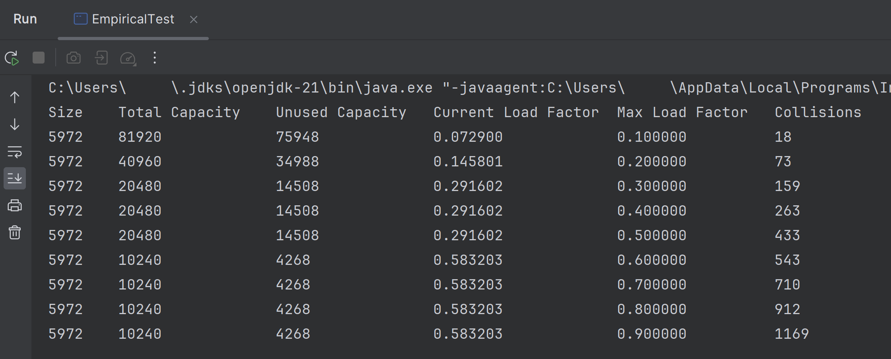

# Individual Assignment: Hash Tables 

For this assignment, you will be building a basic hash table using open addressing with linear 
probing. In open addressing tables, all elements are stored within the array itself, and 
collisions are resolved by moving to the next available slot in the array according to a 
probing sequence. 

Linear probing handles collisions by placing the collided item in the 
next empty slot found linearly in the table. It's crucial to manage the load factor properly 
in such tables to maintain efficient operations, since a high load factor can lead to many 
collisions, which in turn degrade the performance of the hash table.

## Objectives

**Course:**
- Develop a set or map data structure based on hash tables and implement basic set operations.

**Module:**
- To utilize hash codes for quickly determining new or existing elements' positions in a data structure.
- To resolve collisions using open addressing with linear probing.
- To write an iterator over a complex structure.

## Open Addressing with Linear Probing

Unlike separate chaining, where a linked list is used at each index to handle collisions, 
open addressing with linear probing places all elements directly in the hash table array. 


When adding an element and a collision occurs, the table is probed linearly (i.e., checking 
the next index) until an empty slot is found. This method ensures all table slots are utilized, 
reducing wasted space.


<p style="font-style: italic">Note: It may sometimes be necessary to search the table around its boundaries. In such cases
the probing should using the modulus operator to ensure that the next index will never be invalid.
For example, to move to the next higher index, you could do the following:</p>

```java
int nextIndex = (currentIndex + 1) % table.length
```

## Writing the Hash Table

Your task is to implement the open-addressing hash table with linear probing as described 
above. Some starter files have been provided for you:

- **ISet:** An interface that your data structure should implement. This defines the methods
  in the hash table and how they should behave. 
    - Note: Your hash table will be (roughly) based on a 
    <a href="https://en.wikipedia.org/wiki/Set_(mathematics)">mathematical set</a> structure.

| Method Signature                 | Description                                                                                                                                                                 |
|----------------------------------|-----------------------------------------------------------------------------------------------------------------------------------------------------------------------------|
| `void add(T element)`            | Adds an element to the collection. No specific ordering is required. |
| `void add(T... elements)`        | Adds a group of elements to the set in a single operation. The structure internals should behave exactly as described in the `add(T element)` method. |
| `void remove(T element)`         | Finds and removes an element from the collection.                                                 |
| `boolean contains(T element)`    | Reports whether the collection contains an element. Returns true if the element is found, otherwise false.                                                                   |
| `int size()`                     | Returns the number of elements in the collection.                                                                                                                           |
| `int capacity()`                 | Returns the available space in the underlying structure that can be used to store new elements.                                                                              |
| `boolean isEmpty()`              | Reports whether the collection is empty or not. Returns true if the collection is empty, otherwise false.                                                                    |
| `void clear()`                   | Removes all elements from the collection.                                                                                                                                    |
| `T find(T element)`              | Returns an element in the collection that matches the input parameter according to the `equals()` method of the parameter. Returns a matching element.                      |
| `Iterator<T> iterator()`         | Returns an iterator over the collection.                                                                                                                                     |

- **HashTable:** The data structure you will implement. The class should use Java generics
  for elements stored in the structure and should also provide an iterator over the 
  data.
- **HashTableTest:** A group of JUnit 5 tests that can be used to verify your work.
- **EmpiricalAnalysis:** A driver class that will be used to analyze your work (see below).


## Verification of the HashTable

When complete, all <span style="text-decoration: underline">unit tests</span> in the 
HashTableTest file should have a pass rating.


Your code is also expected to pass a <span style="text-decoration: underline">linter check</span>
, as previously covered. Any submissions with outstanding linter problems will be returned to 
a student for revision.


### Why is Load Factor Important?

The load factor is a key determinant of the hash table's performance. It is a number that
determines how full a hash table can become, whether you are using separate chaining or
open addressing for the hash table. 

The load factor of a table is defined as $\color{lightgreen}loadFactor = \frac{size}{capacity}$. Where the
size is the number of occupied spots in the hash table and the capacity is the total
spots.

A maximum load factor should be recognized in open-addressing tables to ensure that there
is always a place for new elements in the table and to reduce the number of collisions
in the table. Once the maximum load factor is exceeded, the internal array should be resized and
elements placed into a larger array.

### Resizing the Table:

A good max load factor to test with would be 60%. When the load factor exceeds 60%, it's time 
to resize the hash table to accommodate more elements. Resizing involves creating a new, 
larger array and then rehashing all existing elements into this new array. Rehashing is 
necessary because the position where an element is stored is directly tied to the size 
of the array. As the array size changes, so does the index calculated for each element.


#### Hints for Implementing Resizing:

1. **Detect when to Resize:** Keep track of the number of elements in the table and the
   size of the internal array. When `(size / capacity) > 0.6`,
   initiate the resize process.
2.  **Creating a New Array:** Determine the new size of the array. It's common to double
    the size of the array to ensure that the resized table can accommodate future insertions
    without needing to resize too frequently.
3. **Rehashing Elements:** For each element in the old array, calculate its new position in
   the new, larger array using the hash function. Since the array size has changed, the result
   of the hash function (modulo the new array size) will likely be different for many elements.
4. **Insert Elements into the New Array:** Insert each element into its new position in the
   new array. Remember, collisions will still occur, so linear probing will be necessary
   during this reinsertion process.
5. **Switch to the New Array:** Once all elements have been rehashed and inserted into the
   new array, the new array becomes the active table.

## Empirical Analysis of Load Factor and Console Reporting


To deepen your understanding of how the load factor impacts both the performance (time complexity) 
and space utilization (memory usage) of your hash table, you should make the following changes to 
your `HashTable` class. 

### Modifying the Hash Table Constructor

Alter your hash table's constructor so that it can accept a specified load factor as an 
input parameter. This load factor must be a decimal between 10% (0.1) and 90% (0.9). The 
value you input here will determine the conditions under which your table decides to resize.

### Tracking Collisions

Adapt your hash table implementation to count the number of collisions occurring 
during the add, remove, or search operations for elements. For this purpose, define a 
collision as any instance requiring the probing of a slot other than the one initially determined 
by the hash function due to it being already occupied.

### Performing the Experiment

With the above modifications in place, you should now conduct an experiment to gauge the impact 
of various load factors on your hash table's operational performance and spatial efficiency. 
For each load factor from 10% to 90% (e.g., every 10%), do the following:

Populate your hash table with a predetermined quantity of elements:
- A text file has been provided to help with the experiment. It is located in the files/ 
  directory.
- You should loop over each of the words in the file and add them to the hash table.

Then record the following data points on the Java console:

- **Size:** Total elements actively stored in the hash table.
- **Total Capacity:** The overall number of slots within the hash table's internal array.
- **Unused Capacity:** Slots within the array that remain empty.
- **Current Load Factor:** The ratio of size to total capacity.
- **Max Load Factor:** The load factor threshold set for the hash table, which dictates when   
  resizing should occur.
- **Collisions:** The number of collisions observed when inserting elements in a hash table
  with the current load factor.

Here is an example of what your output may look like:



### Analysis

Include a file in your project folder called $\color{lightgreen}analysis.txt$. Inside the file, provide an answer to the following questions, 
based on the output you are seeing from your experiment.
- How does load factor affect the time efficiency of a hash table?
- How does load factor affect the space efficiency of a hash table?
- Why does the total and unused capacity of the hash table remain the same for high load factors?
- Why do the collisions continue to increase for high load factors when the capacity appears
  to remain the same?

## Requirements

Here are some reminders on how to submit your work:

- Make sure that all relevant files are committed and push to the Github repository on Github Classroom.
- Before submitting your work, run the unit tests provided to verify your HashTable class.
- Your project <span style="text-decoration: underline">must</span> pass a Linter check to be considered for grading.
- Your project folder should have an $\color{lightgreen}analysis.txt$ file answering the questions above.
